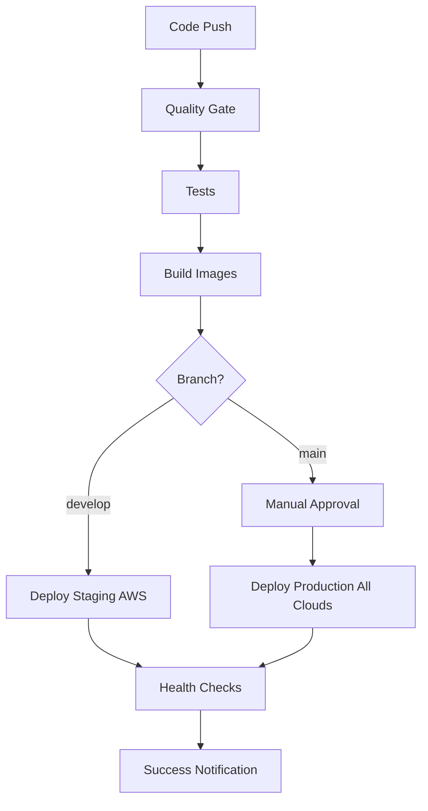

# Multi-Cloud CI/CD Pipeline Documentation

This document describes the comprehensive CI/CD pipeline setup for the Xfinity AI platform that supports deployment across AWS, Azure, and Google Cloud Platform.

## 🚀 Pipeline Overview

Our CI/CD pipeline provides:

- **Multi-cloud deployment** (AWS, Azure, GCP)
- **Environment separation** (staging, production)
- **Automated testing** (backend, frontend, security)
- **Container image management**
- **Database migrations**
- **Health checks and rollback**

## 📋 Pipeline Features

### Quality Gate

- ✅ Python code formatting (Black)
- ✅ Python linting (Flake8)
- ✅ TypeScript build validation
- ✅ Security scanning (Bandit, Safety)
- ✅ Dependency vulnerability checks

### Testing

- ✅ Backend unit tests with PostgreSQL & Redis
- ✅ Frontend build validation
- ✅ Integration tests
- ✅ Code coverage reporting

### Build & Deploy

- ✅ Docker image building
- ✅ Multi-registry push (ECR, ACR, Artifact Registry)
- ✅ Helm-based Kubernetes deployment
- ✅ Database migrations
- ✅ Health checks
- ✅ Rollback on failure

## 🔧 Supported Platforms

### 1. GitHub Actions (Primary)

**File**: `.github/workflows/ci-cd-pipeline.yml`

**Features**:

- Path-based change detection
- Parallel job execution
- Environment protection rules
- Manual deployment triggers
- Secret management

**Usage**:

```bash
# Automatic triggers
git push origin develop  # → Deploy to staging
git push origin main     # → Deploy to production

# Manual triggers
# Go to Actions → Select workflow → Run workflow
```

### 2. GitLab CI/CD

**File**: `.gitlab-ci.yml`

**Features**:

- Docker-in-Docker builds
- Service containers for testing
- Manual production approvals
- Environment-specific deployments

**Usage**:

```bash
# Push to trigger pipeline
git push origin develop  # → Staging
git push origin main     # → Production (manual approval)
```

### 3. Azure DevOps

**File**: `azure-pipelines.yml`

**Features**:

- Multi-stage pipelines
- Azure Container Registry integration
- Environment gates
- Approval workflows

## 🛠️ Setup Instructions

### Prerequisites

1. **Cloud Accounts**:

   - AWS account with EKS access
   - Azure account with AKS access
   - Google Cloud account with GKE access

2. **Container Registries**:

   - AWS ECR repositories
   - Azure Container Registry
   - Google Artifact Registry

3. **Kubernetes Clusters**:
   - Staging and production clusters in each cloud
   - Proper RBAC configuration

### Step 1: Configure Secrets

#### GitHub Secrets Setup

See `.github/SECRETS.md` for detailed instructions.

#### GitLab Variables Setup

Navigate to Project → Settings → CI/CD → Variables:

```bash
# Core secrets
SECRET_KEY: your-32-character-secret-key
OPENAI_API_KEY: sk-proj-...
DB_PASSWORD: your-database-password

# AWS secrets
AWS_ACCESS_KEY_ID: AKIA...
AWS_SECRET_ACCESS_KEY: wJal...
AWS_ACCOUNT_ID: 123456789012

# Azure secrets
AZURE_REGISTRY_LOGIN_SERVER: xfinityai.azurecr.io
AZURE_REGISTRY_USERNAME: xfinityai
AZURE_REGISTRY_PASSWORD: password

# GCP secrets
GCP_SA_KEY: base64-encoded-service-account-key
GCP_PROJECT_ID: xfinity-ai-production
```

#### Azure DevOps Variables Setup

Navigate to Pipelines → Library → Variable Groups:

Create variable groups for each environment with the same secrets as above.

### Step 2: Infrastructure Deployment

Deploy your infrastructure first using Terraform:

```bash
# Deploy to each cloud
cd infrastructure/terraform/aws
terraform apply

cd ../azure
terraform apply

cd ../gcp
terraform apply
```

### Step 3: Initial Application Deployment

For the first deployment, run manually:

```bash
# Set environment variables
export ENVIRONMENT=staging
export CLOUD=aws
export VERSION=initial

# Run deployment script
bash infrastructure/scripts/ci-cd-deploy.sh $ENVIRONMENT $CLOUD $VERSION
```

### Step 4: Configure Kubernetes Secrets

Create secrets in each cluster:

```bash
# For each cloud/environment
kubectl create secret generic xfinity-ai-secrets \
  --from-literal=secret-key="your-secret-key" \
  --from-literal=database-url="postgresql://..." \
  --from-literal=redis-url="redis://..." \
  --from-literal=openai-api-key="sk-..." \
  --namespace=xfinity-ai
```

## 🌍 Multi-Cloud Deployment Strategy

### Cloud Selection Logic

```yaml
# Automatic cloud selection based on branch
develop → AWS staging
main → All clouds production (manual approval)

# Manual cloud selection
workflow_dispatch → Choose specific cloud(s)
```

### Environment Mapping

| Environment | Clouds | Approval Required | Auto-Deploy |
| ----------- | ------ | ----------------- | ----------- |
| Staging     | AWS    | No                | Yes         |
| Production  | All    | Yes               | No          |

### Deployment Flow



## 📊 Monitoring & Observability

### Pipeline Monitoring

1. **GitHub Actions**: View in Actions tab
2. **GitLab CI**: View in CI/CD → Pipelines
3. **Azure DevOps**: View in Pipelines

### Application Monitoring

Post-deployment monitoring includes:

- Kubernetes deployment status
- Application health endpoints
- Database connectivity
- Redis connectivity
- External service availability

### Notification Channels

Configure notifications for:

- ✅ Successful deployments
- ❌ Failed deployments
- ⚠️ Health check failures
- 🔄 Rollback triggers

## 🚨 Troubleshooting

### Common Issues

#### 1. Authentication Failures

```bash
# Check cloud credentials
aws sts get-caller-identity
az account show
gcloud auth list
```

#### 2. Image Pull Failures

```bash
# Verify image exists in registry
docker pull your-registry/xfinity-ai/backend:tag
```

#### 3. Kubernetes Connection Issues

```bash
# Test kubectl connection
kubectl cluster-info
kubectl get nodes
```

#### 4. Database Migration Failures

```bash
# Check migration job logs
kubectl logs job/xfinity-ai-migrate-xxx -n xfinity-ai
```

### Rollback Procedures

#### Automatic Rollback

Helm automatically rolls back on deployment failure.

#### Manual Rollback

```bash
# List releases
helm list -n xfinity-ai

# Rollback to previous version
helm rollback xfinity-ai-aws -n xfinity-ai

# Rollback to specific revision
helm rollback xfinity-ai-aws 3 -n xfinity-ai
```

## 🔒 Security Best Practices

### Secret Management

1. Rotate secrets every 90 days
2. Use environment-specific secrets
3. Enable secret scanning
4. Monitor secret access logs

### Image Security

1. Scan images for vulnerabilities
2. Use minimal base images
3. Sign container images
4. Implement image admission policies

### Network Security

1. Use private container registries
2. Secure inter-service communication
3. Implement network policies
4. Enable encryption in transit

## 📈 Performance Optimization

### Pipeline Performance

- Use build caching
- Parallel job execution
- Incremental builds
- Smart change detection

### Deployment Performance

- Blue-green deployments
- Rolling updates
- Resource preallocation
- Health check optimization

## 🎯 Next Steps

1. **Advanced Monitoring**: Implement comprehensive observability
2. **GitOps**: Transition to ArgoCD for deployment management
3. **Policy as Code**: Implement OPA/Gatekeeper policies
4. **Chaos Engineering**: Add resilience testing
5. **Multi-region**: Expand to multiple regions per cloud

---

## 📞 Support

For CI/CD pipeline support:

1. Check the troubleshooting section above
2. Review pipeline logs for specific errors
3. Consult cloud provider documentation
4. Open an issue in the repository
