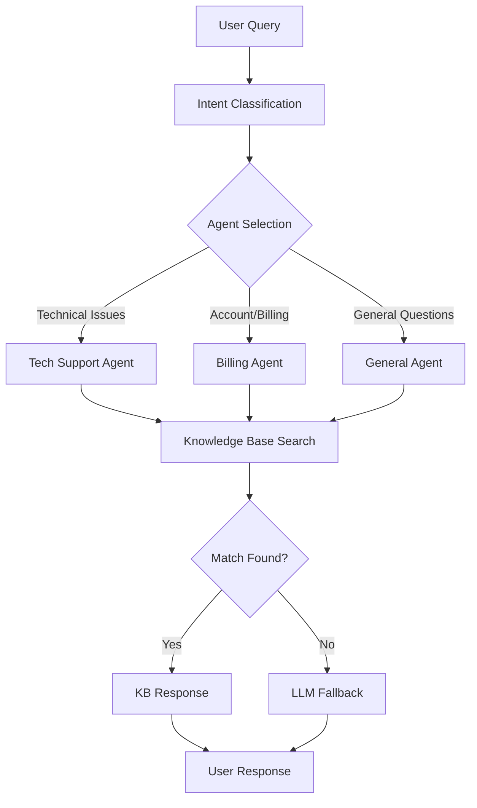

# Documentation

Welcome to the comprehensive documentation for the **Xfinity Agentic AI Demo Platform** - a production-ready demonstration of an intelligent customer support system featuring multi-agent AI, enhanced knowledge base matching, modern dark theme UI, and enterprise-grade monitoring.

This documentation provides detailed guides, architecture explanations, extension instructions, and best practices for both technical implementation and business deployment.

## 📚 Core Documentation

### **Architecture & Design**

- [🏗️ Architecture Overview](./architecture.md) - System components, data flow, and multi-agent design
- [🤖 Agent Routing & Intent Classification](./agent_routing.md) - AI agent coordination and decision making
- [📚 Knowledge Base Format & Management](./knowledge_base.md) - Enhanced KB structure and natural language matching

### **Development & Customization**

- [🔧 Extending the System](./extending.md) - Adding new agents, features, and customizations
- [📊 API Reference](./api_reference.md) - Complete REST and WebSocket API documentation
- [🎨 Frontend Customization](./frontend_customization.md) - UI theming, components, and styling

## 🚀 Getting Started Guides

### **Quick Setup**

- [📖 Main README](../README.md) - Project overview and quick start instructions
- [🔧 Backend Setup](../backend/README.md) - FastAPI, AI services, and database configuration
- [🎨 Frontend Setup](../frontend/README.md) - React app, theme system, and development workflow

### **Operations & Deployment**

- [🚀 Infrastructure & Deployment](../infrastructure/README.md) - Docker, Kubernetes, and cloud deployment
- [📈 Monitoring & Observability](../monitoring/README.md) - Prometheus, Grafana, and alerting setup

## 🆕 What's New

### **Enhanced AI Capabilities**

- **Natural Language Knowledge Base Matching**: Improved query understanding with normalization and word-level matching
- **Enhanced Multi-Agent Routing**: Better intent classification for Tech Support, Billing, and General inquiries
- **Semantic Search Foundation**: Vector embeddings and similarity matching (expanding)

### **Modern UI/UX**

- **Dark Theme System**: Professional dark theme with seamless light mode toggle
- **Advanced Analytics Dashboard**: Interactive Recharts with gradients, animations, and real-time updates
- **Responsive Design**: Mobile-first approach with adaptive layouts
- **Accessibility Improvements**: ARIA labels, keyboard navigation, and screen reader support

### **MLOps & Data Science**

- **Jupyter Notebook Integration**: `mlops_feedback_intent_training.ipynb` for model development
- **Experiment Tracking**: MLflow integration for model versioning and experimentation
- **Data Pipeline Tools**: Apache Airflow support for automated workflows
- **Advanced Analytics**: Enhanced metrics collection and business intelligence

### **Production Features**

- **Enterprise Monitoring**: Comprehensive Grafana dashboards for all system components
- **Performance Optimization**: Database connection pooling, caching strategies, and async operations
- **Security Enhancements**: JWT authentication, input validation, and rate limiting
- **Error Handling**: Structured logging with Sentry integration

## 🎯 Feature Deep Dives

### **Enhanced Knowledge Base Matching**

Our improved knowledge base now supports:

```python
# Natural language variations understood
"internet is out" → "connectivity_issues"
"my wifi isn't working" → "connectivity_issues"
"can't connect" → "connectivity_issues"
"modem problems" → "hardware_troubleshooting"
```

Learn more in [Knowledge Base Format](./knowledge_base.md)

### **Multi-Agent Architecture**



Learn more in [Agent Routing & Intent Classification](./agent_routing.md)

### **Theme System Architecture**

```css
/* CSS Variables for theming */
:root {
  --color-primary: #3b82f6;
  --color-background: #0f172a;
  --color-surface: #1e293b;
  --color-text: #f8fafc;
}

[data-theme="light"] {
  --color-background: #ffffff;
  --color-surface: #f8fafc;
  --color-text: #0f172a;
}
```

Learn more in [Frontend Customization](./frontend_customization.md)

## 🔧 Development Workflows

### **Adding New Features**

1. **Backend**: Extend services in `backend/src/services/`
2. **Frontend**: Create components in `frontend/src/components/`
3. **Documentation**: Update relevant docs in `docs/`
4. **Testing**: Add tests in respective `tests/` directories
5. **Monitoring**: Update Grafana dashboards if needed

### **Customizing the Knowledge Base**

1. Edit `backend/src/xfinity_knowledge_base.json`
2. Add new categories with keywords and responses
3. Test with various natural language queries
4. Monitor performance via analytics dashboard

### **Theme Customization**

1. Modify CSS variables in `frontend/src/styles/globals.css`
2. Update component styles using the design system
3. Test in both light and dark modes
4. Ensure accessibility compliance

## 📊 Analytics & Monitoring

### **Available Metrics**

- **Chat Performance**: Volume, response times, satisfaction scores
- **AI Effectiveness**: Knowledge base hit rates, LLM fallback frequency
- **User Experience**: Session duration, interaction patterns, feature usage
- **System Health**: API response times, database performance, error rates

### **Monitoring Stack**

- **Prometheus**: Metrics collection and alerting
- **Grafana**: Visual dashboards and reporting
- **Sentry**: Error tracking and performance monitoring
- **Structured Logging**: Comprehensive application logging

## 🧪 Testing & Quality Assurance

### **Testing Strategy**

- **Unit Tests**: Individual service and component testing
- **Integration Tests**: API endpoint and database integration
- **End-to-End Tests**: Full user workflow validation (coming soon)
- **Performance Tests**: Load testing and stress testing

### **Quality Metrics**

- **Code Coverage**: Target >80% for critical paths
- **Performance**: <200ms API response times
- **Availability**: >99.9% uptime for production deployments
- **User Satisfaction**: Target >4.5/5 rating

## 🌐 Deployment & Scaling

### **Deployment Options**

- **Docker Compose**: Local development and demo environments
- **Kubernetes**: Production container orchestration
- **Cloud Platforms**: AWS, GCP, Azure with Terraform
- **Edge Deployment**: CDN integration for global performance

### **Scaling Considerations**

- **Horizontal Scaling**: Multiple backend instances with load balancing
- **Database Optimization**: Read replicas and connection pooling
- **Caching Strategy**: Redis for session storage and API response caching
- **CDN Integration**: Static asset delivery optimization

## 🤝 Contributing & Community

### **Contributing Guidelines**

1. Review the [extending documentation](./extending.md)
2. Follow the established code standards and conventions
3. Add comprehensive tests for new features
4. Update documentation for any API or behavior changes
5. Ensure backward compatibility when possible

### **Community Resources**

- **GitHub Issues**: Bug reports and feature requests
- **GitHub Discussions**: Community Q&A and feature discussions
- **Documentation Updates**: Keep docs current with latest changes
- **Example Projects**: Showcase implementations and use cases

## 🔮 Roadmap & Future Features

### **Short Term (Next Release)**

- **Advanced Semantic Search**: Vector similarity with embeddings
- **Multi-language Support**: Internationalization and localization
- **Enhanced Security**: OAuth2 integration and role-based access
- **Performance Optimization**: Query optimization and caching improvements

### **Medium Term (Coming Soon)**

- **Custom Agent Builder**: GUI for creating specialized agents
- **Advanced Analytics**: Predictive insights and trend analysis
- **Integration Hub**: Pre-built connectors for common platforms
- **Mobile Application**: Native iOS and Android apps

### **Long Term (Future Vision)**

- **AI Model Fine-tuning**: Custom model training on organization data
- **Voice Integration**: Speech-to-text and text-to-speech capabilities
- **Advanced Workflow**: Complex multi-step problem resolution
- **Enterprise Features**: SSO, advanced security, compliance tools

---

## 📞 Support & Resources

### **Getting Help**

- **Documentation Issues**: Submit GitHub issues for doc improvements
- **Technical Support**: Check GitHub Discussions for community help
- **Feature Requests**: Use GitHub Issues with feature request template
- **Security Issues**: Email security@yourcompany.com (replace with actual contact)

### **Additional Resources**

- **Video Tutorials**: Coming soon - setup and customization guides
- **Example Implementations**: Reference implementations for common use cases
- **Best Practices**: Deployment and optimization guides
- **Community Showcase**: Real-world implementations and case studies

---

**Last Updated**: January 2024 | **Version**: 2.0.0 | **License**: MIT
