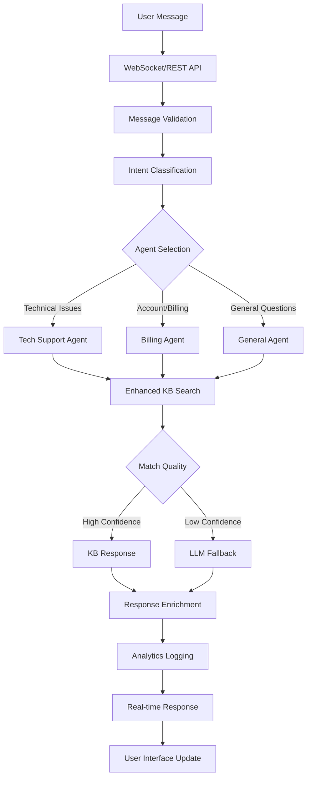

# Architecture Overview

## 🏗️ System Architecture

The **Xfinity Agentic AI Demo Platform** is a comprehensive, production-ready customer support system built on modern microservices architecture with enterprise-grade monitoring, enhanced AI capabilities, and a sophisticated user interface.

## 🎯 Core Components

### **🤖 Intelligent Backend (FastAPI, LangChain, OpenAI)**

#### **Multi-Agent AI System**

- **Tech Support Agent**: Hardware troubleshooting, connectivity issues, equipment setup
- **Billing Agent**: Payment processing, plan management, account inquiries
- **General Agent**: Company policies, service information, general inquiries
- **Coordinator Agent**: Intent classification and intelligent routing

#### **Enhanced Knowledge Base Engine**

- **Natural Language Processing**: Advanced keyword normalization and matching
- **Category Name Matching**: Searches both keywords and category names
- **Bidirectional Substring Matching**: Flexible pattern recognition
- **Semantic Search Foundation**: Vector embeddings for future enhancement
- **LLM Fallback**: OpenAI GPT integration for complex queries

#### **Production Features**

- **Real-time & REST APIs**: WebSocket and traditional HTTP endpoints
- **Analytics Tracking**: Comprehensive metrics collection and business intelligence
- **Async Operations**: High-performance async/await patterns
- **Monitoring Integration**: Prometheus metrics and structured logging

### **🎨 Modern Frontend (React, TypeScript, Tailwind CSS)**

#### **Advanced UI/UX System**

- **Dark/Light Theme Toggle**: Professional theme system with CSS variables
- **Interactive Analytics Dashboard**: Advanced Recharts visualizations with gradients
- **Responsive Design**: Mobile-first approach with adaptive layouts
- **Real-time Chat Interface**: WebSocket-powered messaging with typing indicators

#### **Component Architecture**

- **Modular Components**: Reusable UI elements with consistent design system
- **State Management**: Zustand for lightweight, predictable state handling
- **Type Safety**: Comprehensive TypeScript integration
- **Performance Optimization**: Code splitting and lazy loading

### **📊 Analytics & Business Intelligence**

#### **Real-time Metrics**

- **Chat Performance**: Volume trends, response times, satisfaction scores
- **AI Effectiveness**: Knowledge base hit rates, LLM fallback frequency
- **User Experience**: Session analytics, feature usage, engagement patterns
- **System Health**: API performance, database metrics, error tracking

#### **Visual Dashboards**

- **Interactive Charts**: Gradient-filled area charts, radial progress indicators
- **Performance Metrics**: Real-time system monitoring with hover effects
- **Business KPIs**: Customer satisfaction, resolution rates, agent efficiency
- **Trend Analysis**: Historical data and predictive insights

## 🔄 Enhanced Data Flow

### **Message Processing Pipeline**



### **Enhanced Knowledge Base Matching**

```python
def enhanced_search_pipeline(query: str) -> dict:
    """Enhanced knowledge base search with multiple matching strategies"""

    # 1. Normalize input query
    normalized_query = normalize_text(query)
    query_words = set(normalized_query.split())

    # 2. Multi-level matching
    for agent_name, agent_data in knowledge_base["agents"].items():
        for category_name, category_data in agent_data["categories"].items():

            # Category name matching
            if normalized_query in normalize_text(category_name):
                return create_response(category_data, confidence=0.95)

            # Keyword overlap matching (≥2 words)
            category_keywords = set(normalize_text(" ".join(category_data["keywords"])).split())
            overlap = len(query_words.intersection(category_keywords))
            if overlap >= 2:
                confidence = min(0.9, overlap * 0.3)
                return create_response(category_data, confidence=confidence)

            # Substring matching with scoring
            for keyword in category_data["keywords"]:
                if keyword.lower() in normalized_query or normalized_query in keyword.lower():
                    return create_response(category_data, confidence=0.8)

    # 3. Semantic similarity (future enhancement)
    # semantic_score = compute_similarity(query, kb_embeddings)

    # 4. LLM fallback for unmatched queries
    return llm_fallback(query)
```

## 🧠 Multi-Agent Intelligence

### **Agent Specialization**

#### **Tech Support Agent**

```json
{
  "specialization": "Technical issues and troubleshooting",
  "categories": {
    "connectivity_issues": {
      "keywords": [
        "internet",
        "wifi",
        "connection",
        "outage",
        "down",
        "slow",
        "not working"
      ],
      "natural_variations": [
        "internet is out",
        "wifi not working",
        "can't connect"
      ]
    },
    "hardware_troubleshooting": {
      "keywords": ["modem", "router", "cable box", "remote", "equipment"],
      "natural_variations": [
        "modem problems",
        "router issues",
        "cable box not working"
      ]
    }
  }
}
```

#### **Billing Agent**

```json
{
  "specialization": "Account management and billing",
  "categories": {
    "payment_issues": {
      "keywords": ["payment", "bill", "charge", "autopay", "credit card"],
      "natural_variations": [
        "can't pay bill",
        "payment problems",
        "billing issues"
      ]
    },
    "plan_management": {
      "keywords": ["upgrade", "downgrade", "plan", "package", "service"],
      "natural_variations": [
        "change my plan",
        "upgrade service",
        "different package"
      ]
    }
  }
}
```

### **Intent Classification Engine**

```python
class IntentClassifier:
    """Advanced intent classification with confidence scoring"""

    def classify_intent(self, message: str) -> dict:
        # Technical keywords
        tech_keywords = ["internet", "wifi", "modem", "connection", "slow", "outage"]
        # Billing keywords
        billing_keywords = ["bill", "payment", "charge", "plan", "upgrade", "account"]
        # General keywords
        general_keywords = ["hours", "location", "contact", "policy", "information"]

        scores = {
            "tech_support": self.calculate_score(message, tech_keywords),
            "billing": self.calculate_score(message, billing_keywords),
            "general": self.calculate_score(message, general_keywords)
        }

        intent = max(scores, key=scores.get)
        confidence = scores[intent]

        return {
            "intent": intent,
            "confidence": confidence,
            "all_scores": scores
        }
```

## 🎨 Modern UI Architecture

### **Theme System**

```css
/* CSS Variables for comprehensive theming */
:root {
  /* Primary Colors */
  --color-primary: #3b82f6;
  --color-primary-dark: #1d4ed8;
  --color-secondary: #10b981;

  /* Background System */
  --color-background: #0f172a;
  --color-surface: #1e293b;
  --color-surface-hover: #334155;

  /* Typography */
  --color-text: #f8fafc;
  --color-text-muted: #94a3b8;
  --color-text-inverse: #0f172a;

  /* Interactive Elements */
  --color-border: #334155;
  --color-focus: #3b82f6;
  --color-error: #ef4444;
  --color-success: #10b981;
  --color-warning: #f59e0b;
}

[data-theme="light"] {
  --color-background: #ffffff;
  --color-surface: #f8fafc;
  --color-text: #0f172a;
  --color-text-muted: #64748b;
  /* Light theme overrides */
}
```

### **Component Architecture**

```typescript
// Modern component structure with TypeScript
interface ChatInterfaceProps {
  messages: Message[];
  onSendMessage: (content: string) => void;
  isTyping: boolean;
  theme: "light" | "dark";
}

export const ChatInterface: React.FC<ChatInterfaceProps> = ({
  messages,
  onSendMessage,
  isTyping,
  theme,
}) => {
  const { socket, isConnected } = useWebSocket(WS_URL);
  const { analytics } = useAnalytics();

  return (
    <div className={cn(styles.container, styles[theme])}>
      <MessageList messages={messages} />
      <TypingIndicator visible={isTyping} />
      <MessageInput onSend={onSendMessage} disabled={!isConnected} />
    </div>
  );
};
```

## 📊 Analytics & Monitoring Architecture

### **Metrics Collection**

```python
# Backend metrics instrumentation
from prometheus_client import Counter, Histogram, Gauge

# Chat metrics
chat_messages_total = Counter(
    'chat_messages_total',
    'Total chat messages processed',
    ['agent', 'intent', 'source']
)

chat_response_time = Histogram(
    'chat_response_time_seconds',
    'Chat response processing time',
    ['agent']
)

# Knowledge base metrics
kb_hits_total = Counter(
    'knowledge_base_hits_total',
    'Knowledge base search hits',
    ['agent', 'category', 'match_type']
)

# User experience metrics
user_satisfaction = Histogram(
    'user_satisfaction_score',
    'User satisfaction ratings',
    buckets=[1, 2, 3, 4, 5]
)
```

### **Real-time Dashboard Integration**

```typescript
// Frontend analytics integration
const AnalyticsDashboard: React.FC = () => {
  const { data: metrics } = useAnalytics({
    refreshInterval: 30000,
    metrics: [
      "chat_volume",
      "response_times",
      "satisfaction_scores",
      "intent_distribution",
      "kb_effectiveness",
    ],
  });

  return (
    <div className={styles.dashboard}>
      <MetricsCard
        title="Chat Volume"
        value={metrics.totalChats}
        trend="up"
        trendValue={12}
      />
      <ResponseTimeChart data={metrics.responseTimes} />
      <SatisfactionRadialChart score={metrics.avgSatisfaction} />
      <IntentDistributionChart data={metrics.intentBreakdown} />
    </div>
  );
};
```

## 🔬 MLOps & Data Science Integration

### **Machine Learning Pipeline**

```python
# MLflow experiment tracking
import mlflow
import mlflow.sklearn

class IntentClassificationPipeline:
    """ML pipeline for intent classification improvement"""

    def __init__(self):
        self.experiment_name = "intent-classification"
        mlflow.set_experiment(self.experiment_name)

    def train_model(self, training_data):
        with mlflow.start_run():
            # Model training
            model = self.create_model()
            model.fit(training_data.X, training_data.y)

            # Metrics logging
            accuracy = model.score(test_data.X, test_data.y)
            mlflow.log_metric("accuracy", accuracy)
            mlflow.log_metric("f1_score", f1_score(test_data.y, predictions))

            # Model registration
            mlflow.sklearn.log_model(model, "intent_classifier")

    def deploy_model(self, model_uri):
        """Deploy trained model to production"""
        model = mlflow.sklearn.load_model(model_uri)
        return model
```

### **Feedback Loop Integration**

```python
class FeedbackProcessor:
    """Process user feedback for continuous improvement"""

    def collect_feedback(self, conversation_id: str, rating: int, comments: str):
        feedback_data = {
            "conversation_id": conversation_id,
            "rating": rating,
            "comments": comments,
            "timestamp": datetime.utcnow(),
            "context": self.get_conversation_context(conversation_id)
        }

        # Store for ML training
        self.store_feedback(feedback_data)

        # Update real-time metrics
        user_satisfaction.observe(rating)

        # Trigger retraining if needed
        if self.should_retrain():
            self.trigger_model_retraining()
```

## 🛡️ Security & Production Readiness

### **Authentication & Authorization**

```python
# JWT-based authentication
from fastapi_users import FastAPIUsers
from fastapi_users.authentication import JWTAuthentication

class AuthenticationManager:
    """Secure authentication and authorization"""

    def __init__(self):
        self.jwt_auth = JWTAuthentication(
            secret=settings.JWT_SECRET,
            lifetime_seconds=3600,
            tokenUrl="/auth/token"
        )

    async def authenticate_user(self, credentials: UserCredentials):
        user = await self.verify_credentials(credentials)
        if user:
            token = await self.jwt_auth.get_login_response(user)
            return token
        raise AuthenticationError("Invalid credentials")
```

### **Input Validation & Sanitization**

```python
from pydantic import BaseModel, validator

class ChatMessage(BaseModel):
    content: str
    role: str
    timestamp: datetime

    @validator('content')
    def validate_content(cls, v):
        if len(v) > 1000:
            raise ValueError('Message too long')
        # Sanitize input
        return html.escape(v.strip())

    @validator('role')
    def validate_role(cls, v):
        if v not in ['user', 'assistant']:
            raise ValueError('Invalid role')
        return v
```

## 🔧 Performance Optimization

### **Caching Strategy**

```python
# Redis-based caching
import redis
from functools import wraps

class CacheManager:
    """Intelligent caching for performance optimization"""

    def __init__(self):
        self.redis_client = redis.Redis(
            host=settings.REDIS_HOST,
            port=settings.REDIS_PORT,
            decode_responses=True
        )

    def cache_kb_results(self, query: str, result: dict, ttl: int = 3600):
        """Cache knowledge base search results"""
        cache_key = f"kb_search:{hashlib.md5(query.encode()).hexdigest()}"
        self.redis_client.setex(cache_key, ttl, json.dumps(result))

    def get_cached_result(self, query: str) -> Optional[dict]:
        """Retrieve cached knowledge base result"""
        cache_key = f"kb_search:{hashlib.md5(query.encode()).hexdigest()}"
        cached = self.redis_client.get(cache_key)
        return json.loads(cached) if cached else None
```

### **Database Optimization**

```python
# Async database operations with connection pooling
from sqlalchemy.ext.asyncio import create_async_engine, AsyncSession

class DatabaseManager:
    """Optimized database operations"""

    def __init__(self):
        self.engine = create_async_engine(
            settings.DATABASE_URL,
            pool_size=20,
            max_overflow=30,
            pool_pre_ping=True,
            echo=settings.DEBUG
        )

    async def log_conversation(self, conversation_data: dict):
        """Efficiently log conversation data"""
        async with AsyncSession(self.engine) as session:
            conversation = Conversation(**conversation_data)
            session.add(conversation)
            await session.commit()
```

## 🚀 Scalability & Deployment

### **Horizontal Scaling**

```yaml
# Kubernetes horizontal pod autoscaler
apiVersion: autoscaling/v2
kind: HorizontalPodAutoscaler
metadata:
  name: backend-hpa
spec:
  scaleTargetRef:
    apiVersion: apps/v1
    kind: Deployment
    name: backend
  minReplicas: 2
  maxReplicas: 20
  metrics:
    - type: Resource
      resource:
        name: cpu
        target:
          type: Utilization
          averageUtilization: 70
    - type: Pods
      pods:
        metric:
          name: chat_requests_per_second
        target:
          type: AverageValue
          averageValue: "100"
```

### **Load Balancing Strategy**

```nginx
# Nginx configuration for load balancing
upstream backend_servers {
    least_conn;
    server backend-1:8000 weight=3;
    server backend-2:8000 weight=3;
    server backend-3:8000 weight=2;

    # Health checks
    health_check interval=30s fails=3 passes=2;
}

location /api/ {
    proxy_pass http://backend_servers;
    proxy_set_header Host $host;
    proxy_set_header X-Real-IP $remote_addr;
    proxy_set_header X-Forwarded-For $proxy_add_x_forwarded_for;

    # WebSocket upgrade
    proxy_http_version 1.1;
    proxy_set_header Upgrade $http_upgrade;
    proxy_set_header Connection "upgrade";
}
```

## 🔮 Future Enhancements

### **Advanced AI Capabilities**

- **Custom Model Fine-tuning**: Domain-specific model training on organization data
- **Multi-modal Support**: Image, voice, and document processing
- **Predictive Analytics**: Proactive issue detection and resolution
- **Advanced Reasoning**: Multi-step problem solving and workflow automation

### **Enhanced User Experience**

- **Voice Integration**: Speech-to-text and text-to-speech capabilities
- **Mobile Applications**: Native iOS and Android apps
- **Accessibility Features**: Enhanced screen reader support and keyboard navigation
- **Personalization**: User preference learning and adaptive interfaces

### **Enterprise Features**

- **SSO Integration**: SAML, OIDC, Active Directory integration
- **Advanced Security**: Zero-trust architecture and compliance frameworks
- **Multi-tenancy**: Organization-specific customization and data isolation
- **API Gateway**: Rate limiting, authentication, and request routing

---

This architecture provides a solid foundation for a production-ready customer support system with room for future enhancements and scaling. The modular design allows for independent development and deployment of components while maintaining system cohesion and performance.
