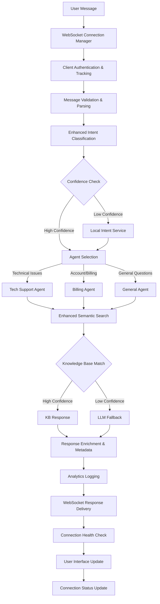
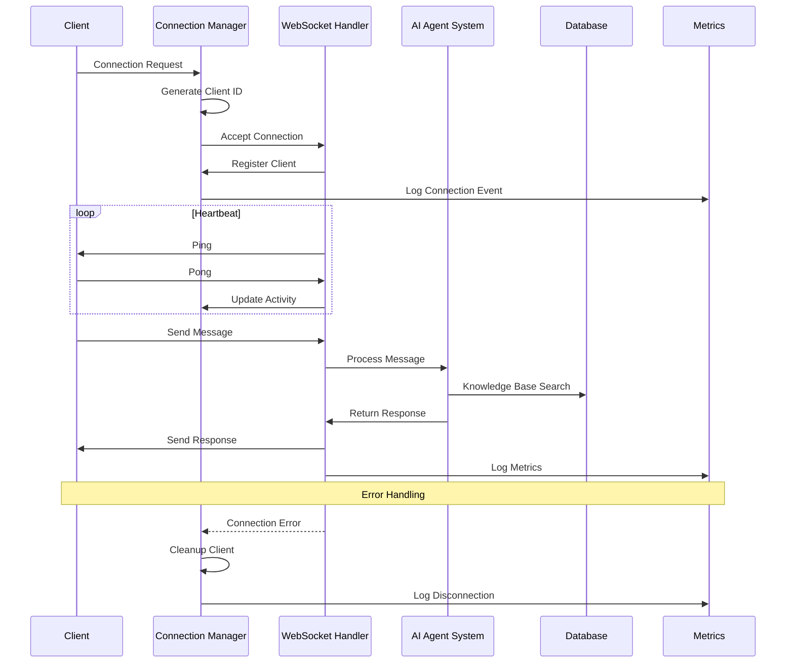

# Architecture Overview

## 🏗️ System Architecture

The **Xfinity Agentic AI Demo Platform** is a comprehensive, production-ready customer support system built on modern microservices architecture with **enterprise-grade WebSocket communication**, enhanced AI capabilities, sophisticated monitoring, and a modern user interface.

## 🎯 Core Components

### **🔌 Enterprise-Grade WebSocket Layer**

#### **Robust Connection Management**

- **Connection Manager**: Client tracking with unique IDs and metadata
- **Automatic Reconnection**: Exponential backoff strategy for connection resilience
- **Heartbeat Keep-Alive**: Ping/pong mechanism prevents connection timeouts
- **Error Recovery**: Graceful handling of network issues without breaking chat flow
- **Real-time Monitoring**: Connection statistics and health tracking

#### **Message Reliability**

- **Delivery Confirmation**: Message acknowledgment and retry logic
- **Queue Management**: Reliable message delivery with proper error handling
- **Connection State Tracking**: Real-time connection health monitoring
- **Performance Optimization**: Connection pooling and message batching

### **🤖 Intelligent Backend (FastAPI, LangChain, OpenAI)**

#### **Multi-Agent AI System**

- **Tech Support Agent**: Hardware troubleshooting, connectivity issues, equipment setup
- **Billing Agent**: Payment processing, plan management, account inquiries
- **General Agent**: Company policies, service information, general inquiries
- **Coordinator Agent**: Enhanced intent classification and intelligent routing

#### **Enhanced Natural Language Understanding**

- **Local Intent Service**: Fast, reliable intent classification with cloud fallback
- **Advanced Pattern Matching**: Multi-pattern matching with confidence scoring
- **Semantic Knowledge Base**: Enhanced search with normalized keyword processing
- **Query Preprocessing**: Handles punctuation, spaces, case variations
- **Confidence Scoring**: Intent classification with reliability metrics

#### **Production Features**

- **Enhanced WebSocket & REST APIs**: Real-time and traditional HTTP endpoints with robust error handling
- **Connection Analytics**: Comprehensive WebSocket metrics collection
- **Async Operations**: High-performance async/await patterns
- **Monitoring Integration**: Prometheus metrics with WebSocket-specific tracking

### **🎨 Modern Frontend (React, TypeScript, Tailwind CSS)**

#### **Enhanced Real-time Communication**

- **Robust WebSocket Integration**: Enterprise-grade messaging with comprehensive error handling
- **Connection Status Indicators**: Visual feedback for WebSocket connection health
- **Automatic Reconnection**: Exponential backoff with user feedback
- **Message Reliability**: Delivery confirmation and error recovery

#### **Advanced UI/UX System**

- **Dark/Light Theme Toggle**: Professional theme system with CSS variables
- **Interactive Analytics Dashboard**: Advanced Recharts visualizations with WebSocket metrics
- **Responsive Design**: Mobile-first approach with adaptive layouts
- **Enhanced Chat Interface**: Rich message display with agent information and confidence scores

#### **Component Architecture**

- **Enhanced Hook System**: Robust WebSocket and chat hooks with error handling
- **State Management**: Zustand for lightweight, predictable state handling with connection tracking
- **Type Safety**: Comprehensive TypeScript integration for WebSocket events
- **Performance Optimization**: Code splitting, lazy loading, and memory management

### **📊 Analytics & Business Intelligence**

#### **Enhanced Real-time Metrics**

- **Chat Performance**: Volume trends, response times, satisfaction scores
- **WebSocket Analytics**: Connection count, message throughput, error rates
- **AI Effectiveness**: Knowledge base hit rates, intent confidence, LLM fallback frequency
- **User Experience**: Session analytics, feature usage, engagement patterns
- **System Health**: API performance, database metrics, connection health tracking

#### **Visual Dashboards**

- **Interactive Charts**: Gradient-filled area charts, radial progress indicators
- **WebSocket Monitoring**: Real-time connection analytics and performance metrics
- **Business KPIs**: Customer satisfaction, resolution rates, agent efficiency
- **Connection Analytics**: WebSocket performance monitoring and error tracking

## 🔄 Enhanced Data Flow

### **WebSocket Message Processing Pipeline**



### **Enhanced WebSocket Connection Lifecycle**



### **Enhanced Knowledge Base Matching**

```python
def enhanced_search_pipeline(query: str, client_id: str = None) -> dict:
    """Enhanced knowledge base search with comprehensive matching strategies"""

    # 1. Query preprocessing and normalization
    normalized_query = preprocess_query(query)
    query_words = set(normalized_query.split())

    # 2. Local intent classification with confidence scoring
    intent_result = local_intent_service.classify_intent(query)
    if intent_result["confidence"] > 0.8:
        agent_type = intent_result["agent_type"]
    else:
        agent_type = None

    # 3. Multi-level semantic search
    search_results = []

    for agent_name, agent_data in knowledge_base["agents"].items():
        # Skip if agent type is specified and doesn't match
        if agent_type and agent_name != agent_type:
            continue

        for category_name, category_data in agent_data["categories"].items():
            confidence = 0.0

            # Exact category name matching
            if normalized_query in normalize_text(category_name):
                confidence = 0.95

            # Enhanced keyword overlap matching
            category_keywords = set(normalize_text(" ".join(category_data["keywords"])).split())
            overlap = len(query_words.intersection(category_keywords))
            if overlap >= 2:
                confidence = max(confidence, min(0.9, overlap * 0.25 + 0.5))

            # Bidirectional substring matching
            for keyword in category_data["keywords"]:
                if keyword.lower() in normalized_query or normalized_query in keyword.lower():
                    confidence = max(confidence, 0.75)

            # Pattern matching with weights
            pattern_score = calculate_pattern_score(query, category_data.get("patterns", []))
            confidence = max(confidence, pattern_score)

            if confidence > 0.6:
                search_results.append({
                    "category": category_data,
                    "confidence": confidence,
                    "agent": agent_name,
                    "matched_keywords": list(query_words.intersection(category_keywords))
                })

    # 4. Rank and return best match
    if search_results:
        best_match = max(search_results, key=lambda x: x["confidence"])
        return create_enhanced_response(best_match, client_id)

    # 5. LLM fallback for unmatched queries
    return llm_fallback(query, client_id, intent_result)

def preprocess_query(query: str) -> str:
    """Enhanced query preprocessing"""
    # Remove punctuation, normalize spaces, convert to lowercase
    normalized = re.sub(r'[^\w\s]', ' ', query.lower())
    return ' '.join(normalized.split())

def calculate_pattern_score(query: str, patterns: List[Dict]) -> float:
    """Calculate confidence score based on pattern matching"""
    max_score = 0.0
    for pattern_data in patterns:
        pattern = pattern_data["pattern"]
        weight = pattern_data.get("weight", 0.5)

        if re.search(pattern, query, re.IGNORECASE):
            max_score = max(max_score, weight)

    return max_score
```

## 🧠 Enhanced Multi-Agent Intelligence

### **Advanced Intent Classification**

```python
class LocalIntentService:
    """
    Local intent classification service with enhanced pattern matching.

    Features:
    - Multi-pattern matching with confidence scoring
    - Keyword normalization and preprocessing
    - Fallback to cloud services
    - Performance optimization
    """

    def __init__(self):
        self.billing_patterns = [
            {"pattern": r"\b(bill|billing|charge|cost|expensive|payment)\b", "weight": 0.9},
            {"pattern": r"\b(cancel|disconnect|service)\b", "weight": 0.7},
            {"pattern": r"\b(refund|credit|discount)\b", "weight": 0.8}
        ]

        self.technical_patterns = [
            {"pattern": r"\b(internet|wifi|connection|slow|down|outage)\b", "weight": 0.9},
            {"pattern": r"\b(router|modem|equipment|device)\b", "weight": 0.8},
            {"pattern": r"\b(speed|performance|lag|buffering)\b", "weight": 0.7}
        ]

        self.general_patterns = [
            {"pattern": r"\b(hours|location|contact|help|support)\b", "weight": 0.8},
            {"pattern": r"\b(policy|terms|conditions)\b", "weight": 0.7}
        ]

    def classify_intent(self, query: str) -> Dict[str, Any]:
        """
        Classify intent with confidence scoring.

        Returns:
        - intent: Classified category
        - confidence: Confidence score (0-1)
        - matched_patterns: Patterns that matched
        - agent_type: Recommended agent
        """
        normalized_query = query.lower()

        # Calculate scores for each category
        billing_score = self._calculate_pattern_score(normalized_query, self.billing_patterns)
        technical_score = self._calculate_pattern_score(normalized_query, self.technical_patterns)
        general_score = self._calculate_pattern_score(normalized_query, self.general_patterns)

        # Determine best match
        scores = {
            "billing": billing_score,
            "technical": technical_score,
            "general": general_score
        }

        best_intent = max(scores, key=scores.get)
        confidence = scores[best_intent]

        # Map intent to agent type
        agent_mapping = {
            "billing": "billing",
            "technical": "tech_support",
            "general": "general"
        }

        return {
            "intent": best_intent,
            "confidence": confidence,
            "agent_type": agent_mapping[best_intent],
            "scores": scores,
            "query": query
        }

    def _calculate_pattern_score(self, query: str, patterns: List[Dict]) -> float:
        """Calculate weighted score for pattern matches"""
        total_score = 0.0
        for pattern_data in patterns:
            if re.search(pattern_data["pattern"], query, re.IGNORECASE):
                total_score += pattern_data["weight"]

        # Normalize score to 0-1 range
        return min(1.0, total_score)
```

### **WebSocket Connection Manager**

```python
class ChatConnectionManager:
    """
    Robust WebSocket connection manager for multi-client chat support.

    Features:
    - Client identification and tracking
    - Connection state management
    - Error handling for failed connections
    - Graceful disconnection handling
    - Performance monitoring
    """

    def __init__(self):
        self.active_connections: Dict[str, WebSocket] = {}
        self.connection_metadata: Dict[str, Dict[str, Any]] = {}
        self.message_queues: Dict[str, List[Dict]] = {}

    async def connect(self, websocket: WebSocket, client_id: str):
        """Accept connection and register client with metadata tracking"""
        await websocket.accept()
        self.active_connections[client_id] = websocket
        self.connection_metadata[client_id] = {
            "connected_at": datetime.utcnow().isoformat(),
            "message_count": 0,
            "last_activity": datetime.utcnow().isoformat(),
            "user_agent": websocket.headers.get("user-agent", "unknown"),
            "ip_address": websocket.client.host if websocket.client else "unknown"
        }

        # Process any queued messages
        await self._process_queued_messages(client_id)

        logger.info(f"Client {client_id} connected. Total connections: {len(self.active_connections)}")

    async def disconnect(self, client_id: str):
        """Remove client and cleanup metadata"""
        if client_id in self.active_connections:
            del self.active_connections[client_id]
        if client_id in self.connection_metadata:
            connection_duration = self._calculate_connection_duration(client_id)
            logger.info(f"Client {client_id} disconnected after {connection_duration}s")
            del self.connection_metadata[client_id]
        if client_id in self.message_queues:
            del self.message_queues[client_id]

        logger.info(f"Client {client_id} disconnected. Total connections: {len(self.active_connections)}")

    async def send_personal_message(self, message: Dict[str, Any], client_id: str):
        """Send message to specific client with error handling and retry logic"""
        if client_id in self.active_connections:
            websocket = self.active_connections[client_id]
            try:
                await websocket.send_json(message)

                # Update activity tracking
                if client_id in self.connection_metadata:
                    self.connection_metadata[client_id]["last_activity"] = datetime.utcnow().isoformat()
                    self.connection_metadata[client_id]["message_count"] += 1

                logger.debug(f"Message sent to client {client_id}")
                return True

            except Exception as e:
                logger.error(f"Failed to send message to client {client_id}: {e}")
                # Queue message for retry or cleanup connection
                await self._handle_send_error(client_id, message, e)
                return False
        else:
            # Queue message if client is not connected
            self._queue_message(client_id, message)
            return False

    def get_connection_stats(self) -> Dict[str, Any]:
        """Get comprehensive connection statistics"""
        total_connections = len(self.active_connections)
        total_messages = sum(
            metadata.get("message_count", 0)
            for metadata in self.connection_metadata.values()
        )

        return {
            "active_connections": total_connections,
            "total_messages_sent": total_messages,
            "average_messages_per_connection": total_messages / max(total_connections, 1),
            "connection_details": self.connection_metadata,
            "queued_messages": sum(len(queue) for queue in self.message_queues.values())
        }
```

## 🚀 Recent Architecture Enhancements

### **WebSocket Reliability Improvements**

- ✅ Implemented enterprise-grade connection manager with client tracking
- ✅ Added comprehensive error handling and recovery mechanisms
- ✅ Introduced heartbeat keep-alive with ping/pong protocol
- ✅ Enhanced reconnection strategies with exponential backoff
- ✅ Added detailed logging and connection monitoring

### **Natural Language Understanding**

- ✅ Advanced intent classification with confidence scoring
- ✅ Local intent service with cloud fallback capabilities
- ✅ Enhanced semantic search with multi-level matching
- ✅ Improved pattern matching algorithms with weighted scoring
- ✅ Query preprocessing and normalization

### **Production Readiness**

- ✅ Enterprise-grade WebSocket architecture
- ✅ Comprehensive metrics and monitoring with WebSocket-specific tracking
- ✅ Graceful error handling and recovery mechanisms
- ✅ Connection health tracking and analytics
- ✅ Performance optimization and scaling considerations

## 📊 Enhanced Monitoring & Observability

### **WebSocket Metrics**

```python
# WebSocket-specific Prometheus metrics
websocket_connections_total = Gauge('websocket_connections_total', 'Active WebSocket connections')
websocket_messages_total = Counter('websocket_messages_total', 'Total WebSocket messages', ['direction', 'client_type'])
websocket_connection_duration = Histogram('websocket_connection_duration_seconds', 'Connection duration')
websocket_errors_total = Counter('websocket_errors_total', 'WebSocket errors', ['error_type', 'client_id'])
websocket_reconnections_total = Counter('websocket_reconnections_total', 'WebSocket reconnection attempts')

# Enhanced chat metrics
intent_classification_confidence = Histogram('intent_classification_confidence', 'Intent confidence scores', ['intent_type'])
knowledge_base_hits = Counter('knowledge_base_hits_total', 'KB search hits', ['agent', 'confidence_level'])
chat_response_time = Histogram('chat_response_time_seconds', 'Chat response time', ['agent_type', 'response_source'])
```

### **Health Check Endpoints**

```python
@router.get("/health")
async def health_check():
    """Comprehensive health check including WebSocket status"""
    websocket_stats = connection_manager.get_connection_stats()

    return {
        "status": "healthy",
        "timestamp": datetime.utcnow().isoformat(),
        "services": {
            "database": await check_database_health(),
            "redis": await check_redis_health(),
            "websocket": {
                "status": "healthy",
                "active_connections": websocket_stats["active_connections"],
                "total_messages": websocket_stats["total_messages_sent"]
            }
        },
        "websocket_stats": websocket_stats
    }

@router.get("/ws/stats")
async def websocket_stats():
    """Detailed WebSocket connection statistics"""
    return connection_manager.get_connection_stats()
```

## 🔧 Configuration & Deployment

### **WebSocket Configuration**

```python
# WebSocket settings
WEBSOCKET_CONFIG = {
    "heartbeat_interval": 30,  # seconds
    "max_connections": 1000,
    "connection_timeout": 300,  # seconds
    "message_queue_size": 100,
    "reconnect_attempts": 5,
    "reconnect_delay": 1000,  # milliseconds
    "enable_compression": True,
    "max_message_size": 1024 * 1024  # 1MB
}
```

### **Scaling Considerations**

#### **Horizontal Scaling**

- **Load Balancing**: Sticky sessions for WebSocket connections
- **Redis Pub/Sub**: Cross-instance message broadcasting
- **Connection Sharding**: Distribute connections across instances
- **Health Checks**: Proper load balancer configuration

#### **Performance Optimization**

- **Connection Pooling**: Efficient resource utilization
- **Message Batching**: Reduce network overhead
- **Compression**: Enable WebSocket compression for large messages
- **Memory Management**: Proper cleanup and garbage collection

## 🔒 Security & Compliance

### **WebSocket Security**

- **Authentication**: JWT token validation for WebSocket connections
- **Rate Limiting**: Per-client message rate limiting
- **Input Validation**: Comprehensive message validation and sanitization
- **CORS Configuration**: Proper cross-origin resource sharing setup
- **SSL/TLS**: Secure WebSocket connections (WSS) in production

### **Data Privacy**

- **Message Encryption**: End-to-end encryption for sensitive data
- **Data Retention**: Configurable message history retention policies
- **Audit Logging**: Comprehensive logging for compliance requirements
- **GDPR Compliance**: Data anonymization and deletion capabilities

---

This enhanced architecture provides enterprise-grade reliability, comprehensive monitoring, and production-ready WebSocket communication while maintaining the sophisticated AI capabilities and modern user experience.
